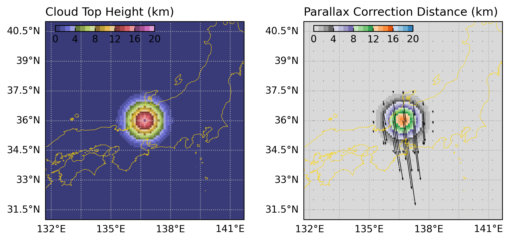
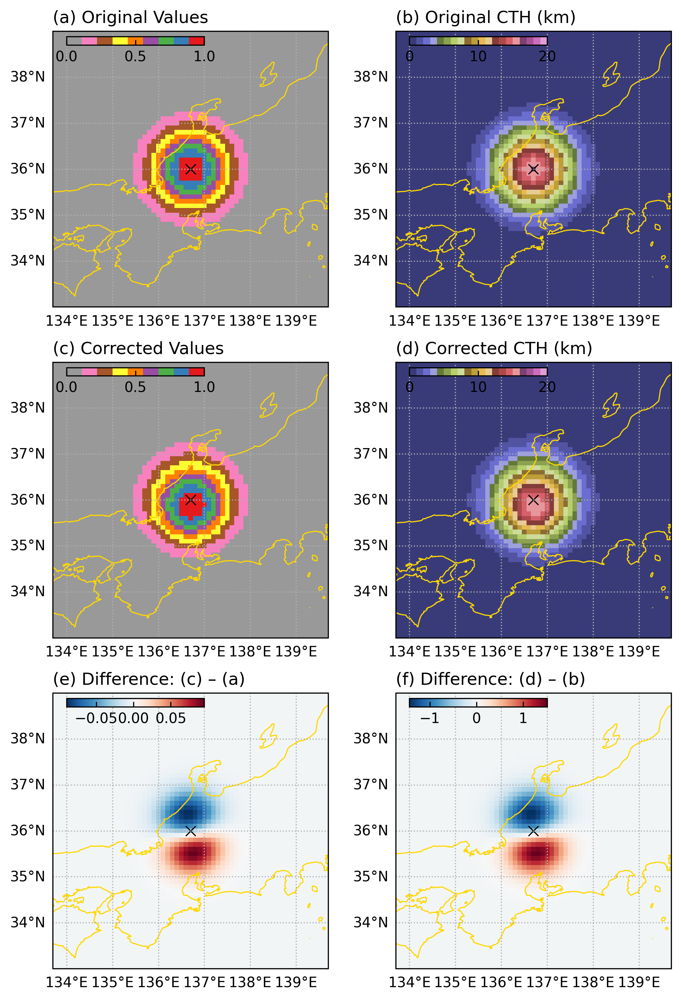

# pyparallax
Python library for parallax correction with Fortran extension

## Requirements
- Python 3.8 or higher
- meson-python
- pip
- setuptools
- wheel

## Dependencies
- numpy>=1.19.5
- pyproj
- xarray

## Installation
1. Clone this repository
    ```bash
    git clone https://github.com/tsukada-cs/pyparallax.git
    cd pyparallax
    ```
2. Install the package using pip (# `.` refers to the current directory):
    ```bash
    pip install .
    ```
    (optional) If you want to install the package in editable mode, use:
    ```bash
    pip install --no-build-isolation -e .
    ```
3. Check the installation:
    ```bash
    python -c "import pyparallax; print(pyparallax.__doc__)"
    ```

## Example usage
Here is an example code to calculate parallax correction distance and perform parallax correction.
First, define satellite position and create sample data:
```python
#%%
import pyproj
import numpy as np

import pyparallax


# Define satellite position
satlon = 140.7
satlat = 0.0

# Create sample exponential cloud data
cloud_lon = satlon-4 # deg away from sub-satellite point
cloud_lat = satlat+36 # deg away from sub-satellite point
cloud_r = 0.6 # in degree

# Create sample data grid
dll = 0.1
lon1d = np.arange(cloud_lon-20, cloud_lon+20+dll, dll)
lat1d = np.arange(cloud_lat-20, cloud_lat+20+dll, dll)
lon2d, lat2d = np.meshgrid(lon1d, lat1d)

values_src = np.exp(-((lon2d-cloud_lon)**2 + (lat2d-cloud_lat)**2)/(2*(cloud_r**2))) * 1.0

# Assign cloud top height (CTH) data
echo_top_height = 16.0 # in km
cth_src = values_src * echo_top_height
```

Then, calculate and plot parallax shift as follows:
```python
#%% Calculate parallax shift
lat_corr, lon_corr = pyparallax.calc_parallax_shift(
    cth=cth_src, lat=lat2d, lon=lon2d,
    satlat=satlat, satlon=satlon, ellps="WGS84"
)

# Plot
import matplotlib.pyplot as plt
import cartopy.crs as ccrs

geod = pyproj.Geod(ellps="WGS84")
_, _, dist = geod.inv(lon2d, lat2d, lon_corr, lat_corr)
correction_dist_km = dist / 1000.0

plot_proj = ccrs.PlateCarree()
data_proj = ccrs.PlateCarree()
fig, ax = plt.subplots(1, 2, figsize=(8.5,4.5), gridspec_kw={"wspace":0.3}, subplot_kw={"projection": plot_proj})

ax[0].pcolormesh(lon1d, lat1d, cth_src, vmin=0, vmax=20, cmap="tab20b", transform=data_proj)
ax[1].pcolormesh(lon1d, lat1d, correction_dist_km, vmin=0, vmax=20, cmap="tab20c_r", transform=data_proj)
slicer = (slice(None,None,5), slice(None,None,5))
ax[1].quiver(lon2d[slicer], lat2d[slicer], (lon_corr-lon2d)[slicer], (lat_corr-lat2d)[slicer], scale=0.3, width=0.003, color="k", transform=data_proj)

ax[0].set_title("Cloud Top Height (km)", loc="left")
ax[1].set_title("Parallax Correction Distance (km)", loc="left")

for i, iax in enumerate(ax.flat):
    iax.set(xlim=[cloud_lon-5, cloud_lon+5], ylim=[cloud_lat-5, cloud_lat+5])
    iax.coastlines(linewidth=0.4, color="gold")
    iax.gridlines(draw_labels=["left","bottom"], linestyle=":")
    
    # Colorbar
    p = iax.get_position()
    cax = fig.add_axes([p.x0+0.05*p.width, p.y1-0.05*p.height, 0.5*p.width, 0.03*p.height])
    fig.colorbar(iax.collections[0], cax=cax, orientation="horizontal")
    cax.tick_params(axis="x", direction="in")
    cax.xaxis.set_major_locator(plt.MultipleLocator(4))

# opath = "./fig_sample1_parallax_correction_distance.png"
# fig.savefig(opath, dpi=300, bbox_inches="tight", pad_inches=0.1)
plt.show()
```
The resulting plot should look like this:


Then, perform parallax correction as follows:
```python
#%% Correction
# 1. Convert to projection coordinate (in this `latlon` coordinates, its just returning the same lon/lat as x/y)
proj = pyproj.Proj(
    proj="lonlat", ellps="WGS84"
)
x_corr, y_corr = proj(lon_corr, lat_corr)

# 2. Define destination grid (same as source grid in this example)
dst_x = lon1d
dst_y = lat1d

# 3. Perform correction
values_corr, cth_corr = pyparallax.perform_correction(
    x_corr, y_corr, values_src, cth_src, dst_x, dst_y, as_xarray=True
)
#%% Plot
plot_proj = ccrs.PlateCarree()
data_proj = ccrs.PlateCarree()
fig, ax = plt.subplots(3,2, figsize=(8,12), subplot_kw={"projection": plot_proj})

for i, iax in enumerate(ax.flat):
    if i == 0:
        title = "(a) Original Values"
        iax.pcolormesh(lon1d, lat1d, values_src, vmin=0, vmax=1, cmap="Set1_r", transform=data_proj)
    if i == 1:
        title = "(b) Original CTH (km)"
        iax.pcolormesh(lon1d, lat1d, cth_src, vmin=0, vmax=20, cmap="tab20b", transform=data_proj)
    if i == 2:
        title = "(c) Corrected Values"
        iax.pcolormesh(dst_x, dst_y, values_corr, vmin=0, vmax=1, cmap="Set1_r", transform=data_proj)
    if i == 3:
        title = "(d) Corrected CTH (km)"
        iax.pcolormesh(dst_x, dst_y, cth_corr, vmin=0, vmax=20, cmap="tab20b", transform=data_proj)
    if i == 4:
        title = "(e) Difference: (c) – (a)"
        iax.pcolormesh(dst_x, dst_y, values_corr-values_src, cmap="RdBu_r", transform=data_proj)
    if i == 5:
        title = "(f) Difference: (d) – (b)"
        iax.pcolormesh(dst_x, dst_y, cth_corr-cth_src, cmap="RdBu_r", transform=data_proj)

    # Cloud location
    iax.scatter(cloud_lon, cloud_lat, marker="x", color="k", s=50, lw=0.8, zorder=2, transform=data_proj)

    # Colorbar
    p = iax.get_position()
    cax = fig.add_axes([p.x0+0.05*p.width, p.y1-0.05*p.height, 0.5*p.width, 0.03*p.height])
    fig.colorbar(iax.collections[0], cax=cax, orientation="horizontal")
    cax.tick_params(axis="x", direction="in")

    # Common settings
    iax.coastlines(linewidth=0.8, color="gold")
    iax.gridlines(draw_labels=["left","bottom"], linestyle=":")
    iax.set_title(title, loc="left")
    iax.tick_params(direction="in", top=True, right=True)
    iax.set(xlim=[cloud_lon-3, cloud_lon+3], ylim=[cloud_lat-3, cloud_lat+3])

# opath = "./fig_sample1_parallax_correction_result.png"
# fig.savefig(opath, dpi=300, bbox_inches="tight", pad_inches=0.1)
plt.show()
```
The resulting plot should look like this:

